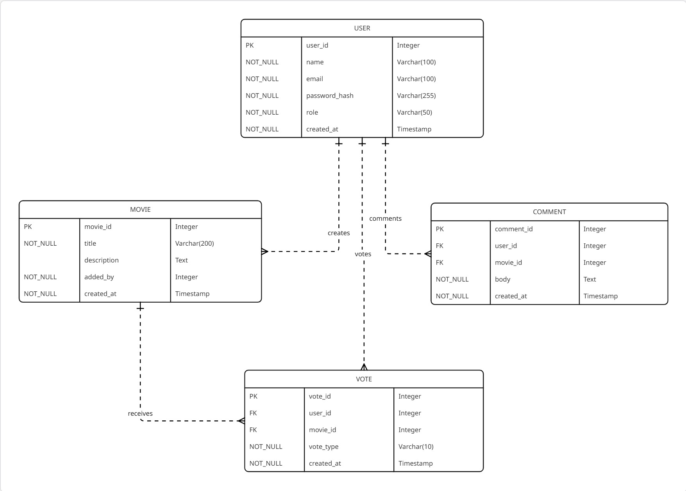

# 🎬 MovieHub Backend

Welcome to **MovieHub Backend**, the server-side engine powering the MovieHub application. This backend is built with Node.js and Express, with MongoDB Atlas as the database.

---

## 🚀 Installation & Setup

### 1. Prerequisites

Before getting started, ensure you have the following installed on your system:

* **[Node.js](https://nodejs.org/)**
* **npm** (comes with Node.js)

Verify installation:

```bash
node -v
npm -v
```

---

### 2. Clone the Repository

```bash
git clone <repository-url>
cd movieHubBackend
```

---

### 3. Configure Environment Variables

Create a `.env` file in the root directory and set the following variables:

```env
PORT=5000                 # Port for the server to run
JWT_SECRET=yourSecretKey  # Secret key for JWT authentication

# MongoDB Atlas Configuration
DB_USERNAME=yourMongoUser
DB_PASSWORD=yourMongoPassword
DB_NAME=moviehub
```

---

### 4. Seed the Database (First-time Only)

Open `db.js` and **uncomment line 17** to insert seed data into your database.

> ⚠️ Remember to comment it back after the initial run to avoid duplicate data.

---

### 5. Install Dependencies

```bash
npm install
```

---

### 6. Start the Server

```bash
node index.js
```

If everything is set up correctly, the server will start on the port specified in your `.env` file 🎉

---

## 🗄️ Database Schema

Here’s the **Entity Relationship (ER) diagram** used in this project:



---

## ✅ You’re All Set!

Now your backend is up and running. Integrate it with the frontend and enjoy the full MovieHub experience. 🍿

---
